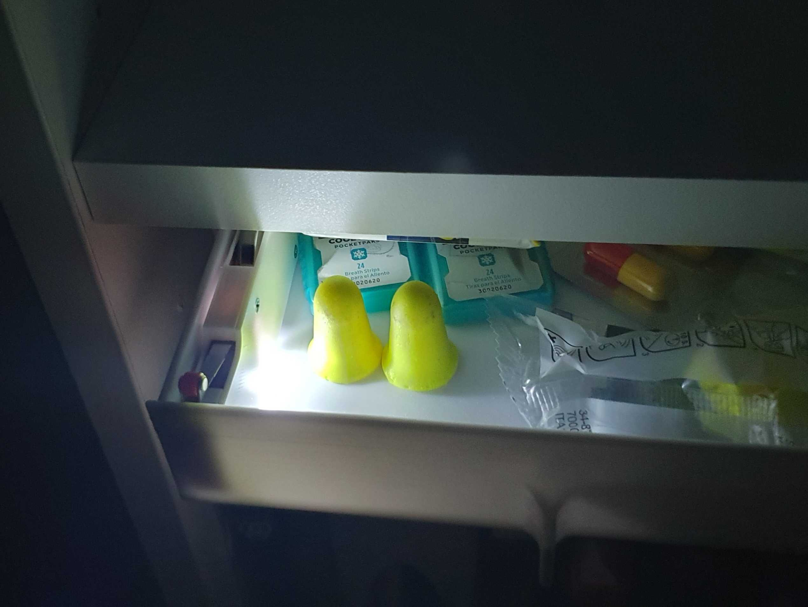
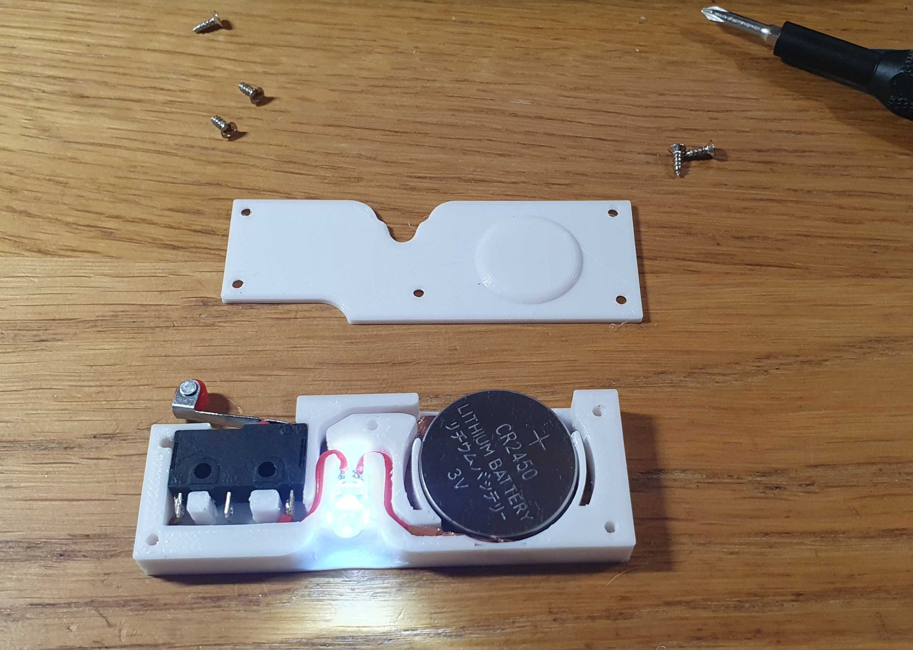

After I designed and installed the [undershelf drawer](https://www.printables.com/model/439540-undershelf-mini-drawer) one thing was missing to find my earplugs in the middle of the night: a little light to see what's inside without waking up my better half.

Here it is.

You'll need one CR 2450 battery, one KW12-3 switch, one 3.2V  5mm white led, some wire, and for the battery contacts I used small pieces of copper sheet tape on which I soldered wires going to the led and to the switch.

5 M2x6 Phillips flat head self tapping screws close it.

The ‘normally open’ contacts of the switch are used (not the middle one).

Once attached to the side of the drawer at the right height it will lit when the drawer is open.

https://github.com/user-attachments/assets/cb3edf1f-74fa-4a00-958d-4c1a4d042e39

